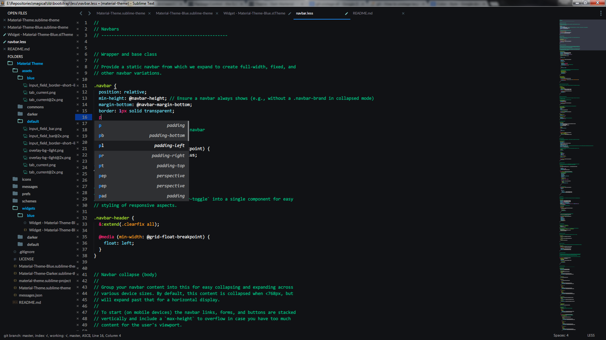
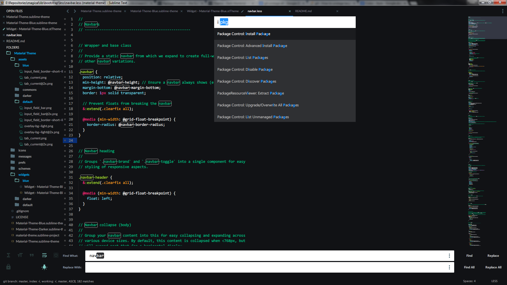
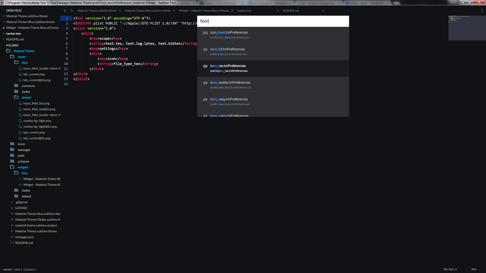

# Material Theme for Sublime Text 3
<!-- This theme brings the [Material Design](http://www.google.com/design/) visual language to your Sublime Text 3. If you have problems report them with an [issue](https://github.com/equinusocio/material-theme/issues). -->
This theme is another style of [Material Theme](https://github.com/equinusocio/material-theme), have some little changes, hope you like it!

<!-- ## Buy me a beer. -->

<!-- Pledgie Donation -->
<!-- <a href='https://pledgie.com/campaigns/29452'></a> -->

<!-- PayPal Donation -->
<!-- [paypalbutton]: https://www.paypalobjects.com/it_IT/IT/i/btn/btn_donate_LG.gif "Donate with PayPal"
[![paypalbutton]](https://www.paypal.com/cgi-bin/webscr?cmd=_s-xclick&hosted_button_id=4LM76KTWW4C2Y)
 -->

## Screenshots







## Package Control
<!-- You can install this awesome theme through the [Package Control](https://packagecontrol.io/installation). Search for *"Material Theme"*, install, **restart Sublime Text** and enjoy! -->
Not supported now.

--

**Manual installation**

1. Clone this repo into your sublime Packages directory. (Preferences > Browse packages...)

2. Activate the theme with the following preferences:

```json
"theme": "Material-Theme-Blue.sublime-theme"
```

***Note*** : Remember to restart Sublime Text after activating the theme.

## Recommended UI and font settings
I suggest you to use this custom settings for a better experience with the theme:

```json
"overlay_scroll_bars": "enabled",
"line_padding_top": 3,
"line_padding_bottom": 3,
"font_options": [ "gray_antialias" ], // On retina Mac
"always_show_minimap_viewport": true,
"bold_folder_labels": true
```

## Thanks
- [@Riccardo-Zanutta](https://github.com/Riccardo-Zanutta) for the windows beta test, site development and support.
- [@irazasyed](https://github.com/irazasyed)